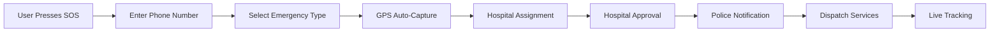

<div align="center">

# 🚨 ResQNet – Smart Emergency Response Network

### *Saving Lives Through Technology*

[](https://github.com)
[](https://github.com)
[](https://github.com)


[Demo](#) • [Documentation](#) • [Report Bug](#) • [Request Feature](#)

</div>

---

## 📋 Table of Contents

- [Problem Statement](#-problem-statement)
- [Our Solution](#-our-solution)
- [Key Features](#-key-features)
- [Innovation & Creativity](#-innovation--creativity)
- [Tech Stack](#-tech-stack)
- [System Architecture](#-system-architecture)
- [Impact & Usability](#-impact--usability)
- [Getting Started](#-getting-started)
- [Team](#-team)
- [License](#-license)

---

## 🚑 Problem Statement

> **Problem ID:** CS05TS

In real-life emergencies such as **road accidents**, **fires**, and **drowning incidents**, victims often face critical delays in receiving timely medical and rescue assistance. 

### Current Challenges:
- ⏱️ Manual emergency calls cause delays
- 📍 Unclear location sharing
- 🔄 Poor coordination between hospitals, police, and rescue services
- ⚠️ Delays during the **critical "golden hour"** increase fatalities

### The Need:
A **fast**, **location-aware**, and **automated emergency response system** that instantly connects victims with hospitals, ambulances, police, and specialized rescue teams.

---

## 💡 Our Solution

**ResQNet** is a web-based smart emergency response platform that enables users to trigger an **SOS alert instantly** without login requirements.

### 🔄 How It Works:



1. **User enters phone number** 📱
2. **Selects emergency type** (Accident / Fire / Water) 🚒
3. **GPS location captured automatically** 📍
4. **Nearest hospital selected** or auto-assigned 🏥
5. **Hospital receives and approves request** ✅
6. **Police notified simultaneously** 👮
7. **Ambulance and rescue services dispatched** 🚑
8. **Live tracking starts** after confirmation 🗺️

---

## ✨ Key Features

<div align="center">

| Feature | Description |
|---------|-------------|
| 🚀 **No Login Required** | Instant SOS without delays from OTP or authentication |
| 🌐 **Multi-Emergency Support** | Handles medical, fire, and water rescue emergencies |
| 📍 **Auto GPS Capture** | Automatically detects and shares precise location |
| 🏥 **Smart Hospital Allocation** | Finds nearest available hospital |
| ✅ **Approval-Based Dispatch** | Real-world workflow with hospital confirmation |
| 🚓 **Police Integration** | Creates green corridor for faster response |
| 📊 **Unified Dashboard** | Centralized control for hospitals and authorities |
| 🛡️ **False SOS Prevention** | Built-in mechanisms to prevent misuse |

</div>

---

## 🎯 Innovation & Creativity

ResQNet stands out from traditional emergency systems:

### What Makes Us Different?

✅ **No Authentication Delays** – Skip login/OTP for instant response  
✅ **Multi-Agency Coordination** – Unlike basic apps, we coordinate hospitals, police, fire, and water rescue simultaneously  
✅ **Hospital-Approved Dispatch** – Real-world workflow ensures resource availability  
✅ **Green Corridor Creation** – Police assistance for faster ambulance movement  
✅ **Unified Platform** – Single dashboard for all emergency services  
✅ **Smart Resource Allocation** – Prevents sending ambulances to full hospitals  

---

## 🛠️ Tech Stack

### Frontend


### Backend


### Database


### APIs & Services
- 📍 **Geolocation API** – Real-time GPS tracking
- 🗺️ **Maps API** – Routing & distance calculation
- 🔄 **WebSockets/Firebase** – Real-time updates
- ☁️ **Vercel/Render/AWS** – Cloud hosting

---

## 🏗️ System Architecture

```
┌─────────────────────────────────────────────────────────────┐
│                        User Interface                        │
│              (Next.js + React + TypeScript)                  │
└─────────────────────────────────────────────────────────────┘
                              │
                              ▼
┌─────────────────────────────────────────────────────────────┐
│                      API Routes Layer                        │
│                    (Next.js Backend)                         │
└─────────────────────────────────────────────────────────────┘
                              │
                ┌─────────────┼─────────────┐
                │             │             │
                ▼             ▼             ▼
         ┌──────────┐  ┌──────────┐  ┌──────────┐
         │ MongoDB  │  │ Maps API │  │ Real-time│
         │ Database │  │  Service │  │ Updates  │
         └──────────┘  └──────────┘  └──────────┘
```

---

## 🌍 Impact & Usability

### 👥 Target Users

| User Group | Role |
|------------|------|
| 👨‍👩‍👧‍👦 **General Public** | Emergency reporters |
| 🏥 **Hospitals** | Request receivers & responders |
| 👮 **Police Departments** | Traffic coordination & support |
| 🚒 **Fire & Rescue Teams** | Specialized emergency response |

### 📈 Real-World Impact

- ⚡ **Faster ambulance dispatch** – Reduced response time
- 🕐 **Improved golden hour survival** – Critical time optimization
- 🤝 **Better inter-service coordination** – Unified emergency response
- 📊 **Higher survival rates** – Data-driven emergency handling
- 👴 **Accessible to all** – Works for non-technical users

---

## 🚀 Getting Started

### Prerequisites

Before you begin, ensure you have installed:
- [Node.js](https://nodejs.org/) (v16 or higher)
- [Git](https://git-scm.com/)
- MongoDB (local or cloud instance)

### Installation

1. **Clone the repository**
   ```bash
   git clone https://github.com/yourusername/resqnet.git
   cd resqnet
   ```

2. **Install dependencies**
   ```bash
   npm install
   # or
   yarn install
   ```

3. **Set up environment variables**
   ```bash
   cp .env.example .env.local
   ```
   
   Edit `.env.local` and add your configuration:
   ```env
   MONGODB_URI=your_mongodb_connection_string
   NEXT_PUBLIC_MAPS_API_KEY=your_maps_api_key
   NEXT_PUBLIC_GEOLOCATION_API_KEY=your_geolocation_key
   ```

4. **Run the development server**
   ```bash
   npm run dev
   # or
   yarn dev
   ```

5. **Open your browser**
   
   Navigate to [http://localhost:3000](http://localhost:3000)

### Build for Production

```bash
npm run build
npm start
```

---

## 👨‍💻 Team

<div align="center">

### **Team: The Information**

*St Aloysius University*

| Role | Member | GitHub |
|------|--------|--------|
| Team Lead | Your Name | [@username](#) |
| Developer | Member 2 | [@username](#) |
| Designer | Member 3 | [@username](#) |

</div>

---

## 📜 License

This project is licensed under the MIT License - see the [LICENSE](LICENSE) file for details.

---

## 🤝 Contributing

Contributions, issues, and feature requests are welcome! Feel free to check [issues page](#).

1. Fork the Project
2. Create your Feature Branch (`git checkout -b feature/AmazingFeature`)
3. Commit your Changes (`git commit -m 'Add some AmazingFeature'`)
4. Push to the Branch (`git push origin feature/AmazingFeature`)
5. Open a Pull Request

---

## 📞 Contact

**Project Link:** [https://github.com/yourusername/resqnet](https://github.com/yourusername/resqnet)

**Problem Statement ID:** CS05TS

---

<div align="center">

### ⭐ Star us on GitHub — it helps!

**Made with ❤️ by Team The Information**

[⬆ back to top](#-resqnet--smart-emergency-response-network)

</div>
